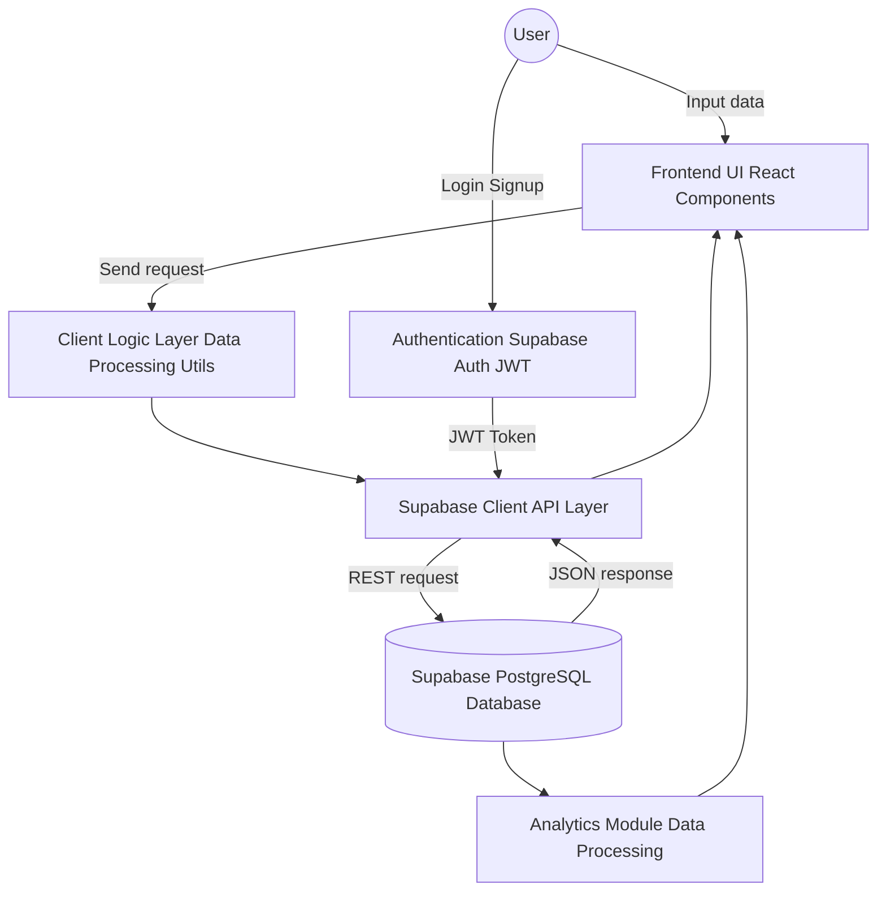

# My Grade Tracker
###  Problem Statement

Students often face difficulties when tracking their academic performance. Modern universities frequently lack a centralized and user-friendly system for personal academic monitoring.
###  Key Problems

Academic grades are stored in multiple disconnected formats:

- paper grade sheets
- scattered Excel files from different instructors
- personal chats and messages
- outdated or non-intuitive university systems

As a result, students struggle to maintain a clear overview of their academic progress. Preparing for exams and final assessments becomes a routine and time-consuming process.

Students often experience difficulties with:

- calculating their current GPA
- tracking semester performance
- predicting required grades for target GPA
- preparing documents for academic mobility and exchange programs


### Overview

My Grade Tracker is a web application designed for academic performance management. It allows students to store grades, organize them by subjects, and monitor their GPA in real time.

### Purpose

The purpose of the project is to create a centralized tool for storing academic history that minimizes the risk of data loss and provides a clear overview of the user's academic progress.

### Main Features

- Secure registration and authentication with email verification and logout functionality
- The system is structured by course and semester, allowing users to filter and manage subjects specifically for the selected academic period
- Data display, PDF report generation, and analytical views are scoped dynamically based on the user's selected course and semester
- Continuous user workflow across all system modules
- Automatic real-time calculation of average and final grades with progress bar visualization and GPA conversion
- CRUD operations for subjects and grades
- Data loss prevention system. If the user modifies information without saving it, the browser displays a confirmation dialog before leaving the page using `beforeunload` and `useBlocker`
- State-based rendering system that displays pages depending on the availability of the user's academic data
- Grade prediction system for calculating the required result to achieve a target grade or avoid failing grades (2 and 3)
- Goal difficulty evaluation system based on the user's available academic data
- "What If?" simulation system that allows users to enter hypothetical grades and model possible final outcomes
- Full support for CSV Import and Export for external data synchronization, plus PDF report generation for academic mobility documentation
- Comprehensive dashboard for viewing performance reports, featuring statistical charts and stability analysis by comparing consecutive grades
- Integrated vitest suite providing modular validation for each system component, ensuring easy verification of all logic blocks
- User performance stability analysis through comparison of differences between consecutive grades


## Technologies Used

Below is the technology stack selected to ensure high performance, strict data typing, and maintainability of the application.

### Frontend

- **React** — The core library used for building the user interface and managing the component-based architecture of the application.

- **TypeScript** — Provides strict data typing and improves application reliability, which is especially important for mathematical calculations and grade processing.

- **Vite** — A modern build tool that provides fast development server startup, efficient hot reload functionality, and optimized production builds.

- **React Router DOM** — Used for application routing and SPA navigation. It is also utilized for navigation blocking logic through `useBlocker`, preventing accidental loss of unsaved data.

- **Tailwind CSS** — A utility-first CSS framework used for building responsive interfaces and a dynamic styling system. It supports responsive layouts, dynamic color states, condition-based styling, and overall UI consistency.


### Backend & Database (Service-Based Architecture)

#### Supabase

A cloud-based backend platform that provides ready-to-use infrastructure for data storage, authentication, and API interaction.


#### PostgreSQL

A relational database used for storing:

- user profiles
- academic data
- grades
- subject history


#### Supabase Auth

A built-in authentication system with support for:

- JWT authentication
- email verification
- session management
- secure login flow


#### PostgREST

An automatically generated REST API that enables secure interaction with the PostgreSQL database without the need for manually implemented backend endpoints.


### DevOps

- Docker
- Docker Compose


### Key Dependencies
I used node.js - v24.16.0

Additional libraries and utilities are used to implement specific application features.

| Dependency | Purpose |
| --- | --- |
| `@supabase/supabase-js` | Client library for CRUD operations and interaction with the Supabase API |
| `lucide-react` | SVG icon library for UI visualization |
| `vitest` | `Framework for unit testing application logic` |
| `react` & `react-dom` | `Core UI library and DOM management` |
| `react-router-dom` | `Application routing and data loss prevention (useBlocker)` |
| `recharts` & `chart.js` | `Data visualization and academic performance analytics` |
| `jspdf` & `jspdf-autotable` | `Generation of PDF reports for academic mobility` |
| `papaparse` | `CSV file parsing for data import and export functionality` |
| `@radix-ui/react-tooltip` | `Accessible UI components for tooltips and badges` |


## Project Structure

```bash
my-grade-tracker/
├── database/
│   ├── policies.sql
│   └── schema.sql
├── src/
│   ├── layouts/
│   ├── pages/
│   ├── shared/
│   ├── styles/
│   ├── tests/
│   ├── utils/
│   ├── widgets/
│   │   ├── analytics/
│   │   ├── calculator/
│   │   └── predictor/
│   ├── App.tsx
│   └── main.tsx
├── .dockerignore
├── .gitignore
├── .env
├── docker-compose.yml
├── Dockerfile
├── package-lock.json
├── package.json
├── README.md
```


## API Endpoints (Supabase Auto-generated)

The application uses the Supabase JavaScript SDK, and all interactions are performed through an automatically generated REST API.

For example:

```ts
supabase.from('grades').select('*')
```
Internally, this is transformed into an HTTP request:
```
GET https://your-project-id.supabase.co/rest/v1/grades
```
Supabase automatically exposes database tables as REST endpoints through the /rest/v1/ route

#### Endpoint Security

- JWT (JSON Web Token) authentication
- Row Level Security (RLS) policy

This means that users can only access their own data, even when interacting with the same endpoint

## Main API Endpoints

| Category   | Method | Endpoint              | Description                     | Auth Required |
|------------|--------|----------------------|---------------------------------|---------------|
| Auth       | POST   | /rest/v1/auth/signup | User registration        | No            |
| Auth       | POST   | /rest/v1/auth/token  | Login and JWT retrieval           | No            |
| Grades     | GET    | /rest/v1/grades      | Retrieve all grades             | Yes           |
| Grades     | POST   | /rest/v1/grades      | Add a new grade           | Yes           |
| Analytics  | GET    | /rest/v1/analytics   | Retrieve analytics data              | Yes           |
| Predictor  | GET    | /rest/v1/predictions | Retrieve academic predictions   | Yes           |

## Database Table


### Table: public.grades


| Name | Type | Constraints |
| --- | --- | --- |
| `id` | `uuid` | Primary Key, Default: `gen_random_uuid()` |
| `title` | `text` | Not Null |
| `rk1` | `numeric` | Nullable, Check: 0–100 |
| `rk2` | `numeric` | Nullable, Check: 0–100 |
| `exam` | `numeric` | Nullable, Check: 0–100 |
| `total_percent` | `numeric` | Nullable |
| `created_at` | `timestamptz` | Default: `now()` |
| `fa_grades` | `jsonb` | Nullable |
| `is_pinned` | `boolean` | Nullable |
| `user_id` | `uuid` | Foreign Key (`auth.users`), Default: `auth.uid()` |
| `rk1_note` | `text` | Nullable |
| `rk2_note` | `text` | Nullable |
| `fa_note` | `text` | Nullable |
| `quarter_note` | `text` | Nullable |
| `course` | `integer` | Not Null, Default: `1` |
| `semester` | `integer` | Not Null, Default: `1` |

---

### Table: public.profiles

| Name | Type | Constraints |
| --- | --- | --- |
| `id` | `uuid` | Primary Key, Foreign Key (`auth.users`) |
| `current_course` | `integer` | Nullable, Default: `1` |
| `current_semester` | `integer` | Nullable, Default: `1` |
## Data Flow

##  Local Deployment via Git

You can clone and run this project locally using either **HTTPS** or **SSH**.


###  Clone via HTTPS

```bash
git clone https://github.com/risvill/my-grade-tracker.git
cd my-grade-tracker

```
### Clone via SSH
```
git clone git@github.com:risvill/my-grade-tracker.git
cd my-grade-tracker
```

### Install dependencies

After cloning the repository, install all required packages:
```
npm install
```

Start the development server:
```
npm run dev
```
Then open in your browser:
```
http://localhost:5173
```
## Running with Docker
To run the frontend locally in an isolated environment, follow these steps:

 - Your Dockerfile should build the React project and serve it using Nginx:
```
FROM node:20-alpine AS build
WORKDIR /app
COPY package*.json ./
RUN npm ci
COPY . .

ARG VITE_SUPABASE_URL
ARG VITE_SUPABASE_ANON_KEY
ENV VITE_SUPABASE_URL=$VITE_SUPABASE_URL
ENV VITE_SUPABASE_ANON_KEY=$VITE_SUPABASE_ANON_KEY

RUN npm run build

FROM nginx:alpine
COPY --from=build /app/dist /usr/share/nginx/html
EXPOSE 80
CMD ["nginx", "-g", "daemon off;"]
```

- Your `docker-compose.yml` file should define how to run the container and pass environment variables:

```
services:
  app:
    build:
      context: .
      args:
        - VITE_SUPABASE_URL=${VITE_SUPABASE_URL}
        - VITE_SUPABASE_ANON_KEY=${VITE_SUPABASE_ANON_KEY}
    ports:
      - "80:80"
```
- Your `.env` file must be configured:

```
VITE_SUPABASE_URL=https://fduvadwenwpigmhymlfs.supabase.co
VITE_SUPABASE_ANON_KEY=sb_publishable_Yp5gzyJ8yp5wyREeGLi2Og_OrDKqcU3

```

To run the project:
```bash
docker compose up --build
```
Access the application:
```bash
http://localhost:5173
```
Stop the containers: 
```bash
docker compose down
```
##  Quick Deployment Guide (Vercel)

This project can be easily deployed using **Vercel** with a GitHub integration.

### 1. Fork the repository

Fork this repository to your GitHub account:
```
https://github.com/risvill/my-grade-tracker.git
```

### 2. Login to Vercel

Go to https://vercel.com and sign in using your GitHub account.


### 3. Import Project

- Click **"Add New..." → "Project"**
- Select your forked repository: `my-grade-tracker`
- Click **Import**


### 4. Configure Environment Variables

In the Vercel project settings, add the following variables:

| Key | Description |
|-----|-------------|
| `VITE_SUPABASE_URL` | Your Supabase project URL |
| `VITE_SUPABASE_ANON_KEY` | Your Supabase anonymous API key |

### 5. Deploy

Click **Deploy**. After a few seconds, your application will be available at a unique Vercel URL like:
```
https://my-grade-tracker.vercel.app/

```

## Future Improvements

The project is planned to be further developed with additional features aimed at improving usability, flexibility, and academic tracking capabilities.

### Planned Features

- Introducing subject categories (e.g., active, completed, archived) to better organize academic progress
- Notification system for academic deadlines or low-performance alerts
- Implementation of a Teacher role enabling academic data management, student oversight, and communication through email-based notification system.

### Author

**Sabrina Baidauletova**

Semester project for the Web Application / IT Project course.


